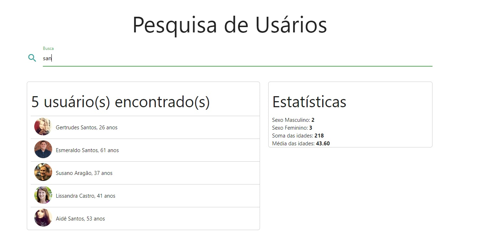

# :dart: Objetivos

Exercitar os seguintes conceitos trabalhados no Módulo:
<ul>
<li>Declarar elementos HTML como títulos, input, div, span, ul, li etc.</li>
<li>Estilizar o app com CSS.</li>
<li>Mapear elementos do DOM para serem manipulados com JavaScript.</li>
<li>Formatar valores com JavaScript.</li>
<li>Realizar diversos cálculos com array methods como map, filter e reduce.</li>
<li>Realizar requisições HTTP com o comando fetch.</li>
</ul>

## :triangular_flag_on_post: Desafio

:heavy_check_mark: <b>1:</b> Na carga inicial da aplicação, obter os dados de: https://randomuser.me/api/?seed=javascript&results=100&nat=BR&noinfo

:heavy_check_mark: <b>2:</b> Carregar os dados dos usuários em um array.

:heavy_check_mark: <b>3:</b> Permitir a filtragem de usuários através de um input com interação do usuário.

:heavy_check_mark: <b>4:</b> O usuário poderá filtrar dados quando digitar pelo menos um caractere no input.

:heavy_check_mark: <b>5:</b> O usuário poderá filtrar os dados tanto digitando "Enter" quanto clicando no botão correspondente, conforme imagens mais abaixo.

:heavy_check_mark: <b>6:</b> Montar dois painéis.

:heavy_check_mark: <b>7:</b> No painel da esquerda, listar os usuários filtrados.

:heavy_check_mark: <b>8:</b> No painel da direita, calcular e mostrar algumas estatísticas sobre esses usuários, conforme imagens abaixo.

# User Search

